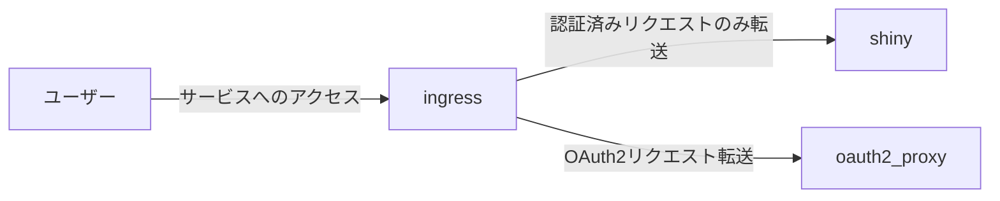

# Shiny on Cloud Run with OAuth2

Shinyアプリをコンテナ化し、Cloud Runにデプロイする。
サイドカーコンテナでOAuth2認証を行い、認証済みのユーザーのみがアクセスできるようにする。

### アーキテクチャ

```mermaid
graph LR
A[ユーザー] -->|サービスへのアクセス| B[ingress]
B -->|認証済みリクエストのみ転送| C[shiny]
B -->|OAuth2リクエスト転送| D[oauth2_proxy]
```

